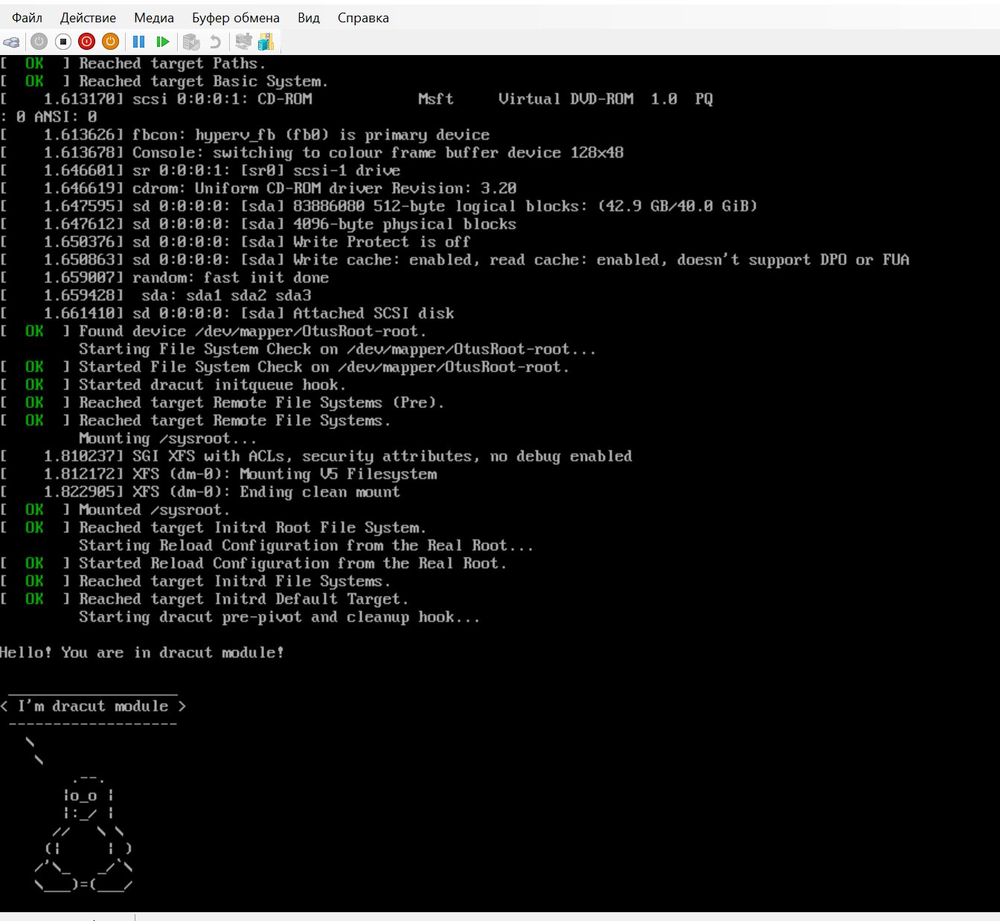

# linuxpro-homework09

## Домашнее задание
### Работа с загрузчиком

Описание/Пошаговая инструкция выполнения домашнего задания:
1. [Попасть в систему без пароля несколькими способами.](#1)
2. [Установить систему с LVM, после чего переименовать VG.](#2)
3. [Добавить модуль в initrd.](#3)

***

<a name="1"/>
</a>

### 1. Попасть в систему без пароля несколькими способами.
- 1й способ: добавим в загрузчик опцию
```
linux init=/bin/bash
```
Имеем Hyper-v: При запуске виртуальной машины, выбираем нужные пункт с загрузкой (например, по умолчанию) и нажимаем "**e**", чтобы попасть в меню редактирования параметров данного пункта загрузки.

В конце строки, начинающейся с linuxefi добавляем init=/bin/bash

и нажимае **ctrl+x** для загрузки системы
Таким образом мы попали сразу в оболочку bash с правами root

После загрузки оболочки необходимо перемонтировать корневой раздел в режим RW, если нам требуется внести какие либо изменения, например, сменить пароль **root**:
```
mount -o remount,rw /
```
- 2й способ: добавим в загрузчик опцию
```
linux rd.break
```
Так же в конце строки добавляем опцию и загружаемся через **ctrl+x**

Таким образом мы попадаем в режим **emergecy mode**. Наша корневая файловая система так же смонтирована в режиме **Read-only**. Далее в нее необходимо попасть следующим образом, и после можно будет сменить пароль от **root**:

- 3й способ: замена параметра
```
rw init=/sysroot/bin/bash
```
Так же заходим в режим редактирования пункта загрузки и заменяем параметр **ro** на **rw init=/sysroot/bin/bash**


нажимаем **ctrl+x** для загрузки в систему.
В таком варианте файловая система уже смонтирована в режиме **Read-write**

***
<a name="2"/>
</a>

### 2. Установить систему с LVM, после чего переименовать VG.

Текущее состояние:
```
root@psql01:/home/ujack# vgs
  VG     #PV #LV #SN Attr   VSize  VFree
  centos   1   2   0 wz--n- 38.80g 4.00m
```
Текущее имя VG **centos**
Переименовываем:
```
root@psql01:/home/ujack# vgrename centos OtusRoot
  Volume group "centos" successfully renamed to "OtusRoot"
```
Правим файл /etc/fstab, исходный
```
root@psql01:/home/ujack# cat /etc/fstab

#
# /etc/fstab
# Created by anaconda on Thu Apr 16 12:47:23 2020
#
# Accessible filesystems, by reference, are maintained under '/dev/disk'
# See man pages fstab(5), findfs(8), mount(8) and/or blkid(8) for more info
#
/dev/mapper/centos-root /                       xfs     defaults        0 0
UUID=34aefd6b-b0cf-4ba7-80be-9556157551a1 /boot                   xfs     defaults        0 0
UUID=9AAB-0C65          /boot/efi               vfat    umask=0077,shortname=winnt 0 0
/dev/mapper/centos-swap swap                    swap    defaults        0 0
```
Заменяем **/centos** на **/OtusRoot**
```
root@psql01:/home/ujack# sed -i "s%/centos%/OtusRoot%" /etc/fstab
root@psql01:/home/ujack# cat /etc/fstab

#
# /etc/fstab
# Created by anaconda on Thu Apr 16 12:47:23 2020
#
# Accessible filesystems, by reference, are maintained under '/dev/disk'
# See man pages fstab(5), findfs(8), mount(8) and/or blkid(8) for more info
#
/dev/mapper/OtusRoot-root /                       xfs     defaults        0 0
UUID=34aefd6b-b0cf-4ba7-80be-9556157551a1 /boot                   xfs     defaults        0 0
UUID=9AAB-0C65          /boot/efi               vfat    umask=0077,shortname=winnt 0 0
/dev/mapper/OtusRoot-swap swap                    swap    defaults        0 0
```
Правим /etc/default/grub, исходный
```
root@psql01:/home/ujack# cat /etc/default/grub
GRUB_TIMEOUT=5
GRUB_DISTRIBUTOR="$(sed 's, release .*$,,g' /etc/system-release)"
GRUB_DEFAULT=saved
GRUB_DISABLE_SUBMENU=true
GRUB_TERMINAL_OUTPUT="console"
GRUB_CMDLINE_LINUX="crashkernel=auto rd.lvm.lv=centos/root rd.lvm.lv=centos/swap rhgb quiet"
GRUB_DISABLE_RECOVERY="true"
```
заменяем **rd.lvm.lv=centos** на **rd.lvm.lv=OtusRoot**
```
root@psql01:/home/ujack# sed -i "s%rd.lvm.lv=centos%rd.lvm.lv=OtusRoot%g" /etc/default/grub
root@psql01:/home/ujack# cat /etc/default/grub
GRUB_TIMEOUT=5
GRUB_DISTRIBUTOR="$(sed 's, release .*$,,g' /etc/system-release)"
GRUB_DEFAULT=saved
GRUB_DISABLE_SUBMENU=true
GRUB_TERMINAL_OUTPUT="console"
GRUB_CMDLINE_LINUX="crashkernel=auto rd.lvm.lv=OtusRoot/root rd.lvm.lv=OtusRoot/swap rhgb quiet"
GRUB_DISABLE_RECOVERY="true"

```
Меняем в файле /boot/efi/EFI/centos/grub.cfg **/centos** на **/OtusRoot** и **rd.lvm.lv=centos** на **rd.lvm.lv=OtusRoot** , исходный
```
root@psql01:/home/ujack# cat /boot/efi/EFI/centos/grub.cfg | grep centos
menuentry 'CentOS Linux (3.10.0-1160.53.1.el7.x86_64) 7 (Core)' --class centos --class gnu-linux --class gnu --class os --unrestricted $menuentry_id_option 'gnulinux-3.10.0-1062.el7.x86_64-advanced-f6fc7d05-d679-430b-8943-0d605321401b' {
        linuxefi /vmlinuz-3.10.0-1160.53.1.el7.x86_64 root=/dev/mapper/centos-root ro crashkernel=auto rd.lvm.lv=centos/root rd.lvm.lv=centos/swap rhgb quiet LANG=en_US.UTF-8
menuentry 'CentOS Linux (3.10.0-1160.24.1.el7.x86_64) 7 (Core)' --class centos --class gnu-linux --class gnu --class os --unrestricted $menuentry_id_option 'gnulinux-3.10.0-1062.el7.x86_64-advanced-f6fc7d05-d679-430b-8943-0d605321401b' {
        linuxefi /vmlinuz-3.10.0-1160.24.1.el7.x86_64 root=/dev/mapper/centos-root ro crashkernel=auto rd.lvm.lv=centos/root rd.lvm.lv=centos/swap rhgb quiet LANG=en_US.UTF-8
menuentry 'CentOS Linux (3.10.0-1062.18.1.el7.x86_64) 7 (Core)' --class centos --class gnu-linux --class gnu --class os --unrestricted $menuentry_id_option 'gnulinux-3.10.0-1062.el7.x86_64-advanced-f6fc7d05-d679-430b-8943-0d605321401b' {
        linuxefi /vmlinuz-3.10.0-1062.18.1.el7.x86_64 root=/dev/mapper/centos-root ro crashkernel=auto rd.lvm.lv=centos/root rd.lvm.lv=centos/swap rhgb quiet LANG=en_US.UTF-8
menuentry 'CentOS Linux (3.10.0-1062.el7.x86_64) 7 (Core)' --class centos --class gnu-linux --class gnu --class os --unrestricted $menuentry_id_option 'gnulinux-3.10.0-1062.el7.x86_64-advanced-f6fc7d05-d679-430b-8943-0d605321401b' {
        linuxefi /vmlinuz-3.10.0-1062.el7.x86_64 root=/dev/mapper/centos-root ro crashkernel=auto rd.lvm.lv=centos/root rd.lvm.lv=centos/swap rhgb quiet LANG=en_US.UTF-8
menuentry 'CentOS Linux (0-rescue-613f37ead2f64f2095b09431510d047e) 7 (Core)' --class centos --class gnu-linux --class gnu --class os --unrestricted $menuentry_id_option 'gnulinux-0-rescue-613f37ead2f64f2095b09431510d047e-advanced-f6fc7d05-d679-430b-8943-0d605321401b' {
        linuxefi /vmlinuz-0-rescue-613f37ead2f64f2095b09431510d047e root=/dev/mapper/centos-root ro crashkernel=auto rd.lvm.lv=centos/root rd.lvm.lv=centos/swap rhgb quiet

```
меняем
```
root@psql01:/home/ujack# sed -i -e "s%/centos%/OtusRoot%g" -e "s%rd.lvm.lv=centos%rd.lvm.lv=OtusRoot%g" /boot/efi/EFI/centos/grub.cfg


root@psql01:/home/ujack# cat /boot/efi/EFI/centos/grub.cfg | grep OtusRoot
        linuxefi /vmlinuz-3.10.0-1160.53.1.el7.x86_64 root=/dev/mapper/OtusRoot-root ro crashkernel=auto rd.lvm.lv=OtusRoot/root rd.lvm.lv=OtusRoot/swap rhgb quiet LANG=en_US.UTF-8
        linuxefi /vmlinuz-3.10.0-1160.24.1.el7.x86_64 root=/dev/mapper/OtusRoot-root ro crashkernel=auto rd.lvm.lv=OtusRoot/root rd.lvm.lv=OtusRoot/swap rhgb quiet LANG=en_US.UTF-8
        linuxefi /vmlinuz-3.10.0-1062.18.1.el7.x86_64 root=/dev/mapper/OtusRoot-root ro crashkernel=auto rd.lvm.lv=OtusRoot/root rd.lvm.lv=OtusRoot/swap rhgb quiet LANG=en_US.UTF-8
        linuxefi /vmlinuz-3.10.0-1062.el7.x86_64 root=/dev/mapper/OtusRoot-root ro crashkernel=auto rd.lvm.lv=OtusRoot/root rd.lvm.lv=OtusRoot/swap rhgb quiet LANG=en_US.UTF-8
        linuxefi /vmlinuz-0-rescue-613f37ead2f64f2095b09431510d047e root=/dev/mapper/OtusRoot-root ro crashkernel=auto rd.lvm.lv=OtusRoot/root rd.lvm.lv=OtusRoot/swap rhgb quiet

```
Пересоздаем **initrd image**, чтобы он знал новое название **Volume Group**
```
root@psql01:/home/ujack# mkinitrd -f -v /boot/initramfs-$(uname -r).img $(uname -r)
Executing: /sbin/dracut -f -v /boot/initramfs-3.10.0-1160.53.1.el7.x86_64.img 3.10.0-1160.53.1.el7.x86_64
dracut module 'modsign' will not be installed, because command 'keyctl' could not be found!
dracut module 'busybox' will not be installed, because command 'busybox' could not be found!
dracut module 'crypt' will not be installed, because command 'cryptsetup' could not be found!
dracut module 'dmraid' will not be installed, because command 'dmraid' could not be found!
dracut module 'dmsquash-live-ntfs' will not be installed, because command 'ntfs-3g' could not be found!
dracut module 'mdraid' will not be installed, because command 'mdadm' could not be found!
dracut module 'multipath' will not be installed, because command 'multipath' could not be found!
dracut module 'cifs' will not be installed, because command 'mount.cifs' could not be found!
dracut module 'iscsi' will not be installed, because command 'iscsistart' could not be found!
dracut module 'iscsi' will not be installed, because command 'iscsi-iname' could not be found!
95nfs: Could not find any command of 'rpcbind portmap'!
dracut module 'modsign' will not be installed, because command 'keyctl' could not be found!
dracut module 'busybox' will not be installed, because command 'busybox' could not be found!
dracut module 'crypt' will not be installed, because command 'cryptsetup' could not be found!
dracut module 'dmraid' will not be installed, because command 'dmraid' could not be found!
dracut module 'dmsquash-live-ntfs' will not be installed, because command 'ntfs-3g' could not be found!
dracut module 'mdraid' will not be installed, because command 'mdadm' could not be found!
dracut module 'multipath' will not be installed, because command 'multipath' could not be found!
dracut module 'cifs' will not be installed, because command 'mount.cifs' could not be found!
dracut module 'iscsi' will not be installed, because command 'iscsistart' could not be found!
dracut module 'iscsi' will not be installed, because command 'iscsi-iname' could not be found!
95nfs: Could not find any command of 'rpcbind portmap'!
*** Including module: bash ***
*** Including module: nss-softokn ***
*** Including module: i18n ***
*** Including module: network ***
*** Including module: ifcfg ***
*** Including module: drm ***
*** Including module: plymouth ***
*** Including module: dm ***
Skipping udev rule: 64-device-mapper.rules
Skipping udev rule: 60-persistent-storage-dm.rules
Skipping udev rule: 55-dm.rules
*** Including module: kernel-modules ***
*** Including module: lvm ***
Skipping udev rule: 64-device-mapper.rules
Skipping udev rule: 56-lvm.rules
Skipping udev rule: 60-persistent-storage-lvm.rules
*** Including module: resume ***
*** Including module: rootfs-block ***
*** Including module: terminfo ***
*** Including module: udev-rules ***
Skipping udev rule: 40-redhat-cpu-hotplug.rules
Skipping udev rule: 91-permissions.rules
*** Including module: biosdevname ***
*** Including module: systemd ***
*** Including module: usrmount ***
*** Including module: base ***
*** Including module: fs-lib ***
*** Including module: microcode_ctl-fw_dir_override ***
  microcode_ctl module: mangling fw_dir
    microcode_ctl: reset fw_dir to "/lib/firmware/updates /lib/firmware"
    microcode_ctl: processing data directory  "/usr/share/microcode_ctl/ucode_with_caveats/intel"...
intel: model '', path ' intel-ucode/*', kvers ''
No matching microcode files in ' intel-ucode/*' for CPU model 'AuthenticAMD 17-71-00', skipping
    microcode_ctl: configuration "intel" is ignored
    microcode_ctl: processing data directory  "/usr/share/microcode_ctl/ucode_with_caveats/intel-06-2d-07"...
intel-06-2d-07: model 'GenuineIntel 06-2d-07', path ' intel-ucode/06-2d-07', kvers ''
Current CPU model 'AuthenticAMD 17-71-00' doesn't match configuration CPU model 'GenuineIntel 06-2d-07', skipping
    microcode_ctl: configuration "intel-06-2d-07" is ignored
    microcode_ctl: processing data directory  "/usr/share/microcode_ctl/ucode_with_caveats/intel-06-4e-03"...
intel-06-4e-03: model 'GenuineIntel 06-4e-03', path ' intel-ucode/06-4e-03', kvers ''
Current CPU model 'AuthenticAMD 17-71-00' doesn't match configuration CPU model 'GenuineIntel 06-4e-03', skipping
    microcode_ctl: configuration "intel-06-4e-03" is ignored
    microcode_ctl: processing data directory  "/usr/share/microcode_ctl/ucode_with_caveats/intel-06-4f-01"...
intel-06-4f-01: model 'GenuineIntel 06-4f-01', path ' intel-ucode/06-4f-01', kvers ' 4.17.0 3.10.0-894 3.10.0-862.6.1 3.10.0-693.35.1 3.10.0-514.52.1 3.10.0-327.70.1 2.6.32-754.1.1 2.6.32-573.58.1 2.6.32-504.71.1 2.6.32-431.90.1 2.6.32-358.90.1'
Current CPU model 'AuthenticAMD 17-71-00' doesn't match configuration CPU model 'GenuineIntel 06-4f-01', skipping
    microcode_ctl: configuration "intel-06-4f-01" is ignored
    microcode_ctl: processing data directory  "/usr/share/microcode_ctl/ucode_with_caveats/intel-06-55-04"...
intel-06-55-04: model 'GenuineIntel 06-55-04', path ' intel-ucode/06-55-04', kvers ''
Current CPU model 'AuthenticAMD 17-71-00' doesn't match configuration CPU model 'GenuineIntel 06-55-04', skipping
    microcode_ctl: configuration "intel-06-55-04" is ignored
    microcode_ctl: processing data directory  "/usr/share/microcode_ctl/ucode_with_caveats/intel-06-5e-03"...
intel-06-5e-03: model 'GenuineIntel 06-5e-03', path ' intel-ucode/06-5e-03', kvers ''
Current CPU model 'AuthenticAMD 17-71-00' doesn't match configuration CPU model 'GenuineIntel 06-5e-03', skipping
    microcode_ctl: configuration "intel-06-5e-03" is ignored
    microcode_ctl: processing data directory  "/usr/share/microcode_ctl/ucode_with_caveats/intel-06-8c-01"...
intel-06-8c-01: model 'GenuineIntel 06-8c-01', path ' intel-ucode/06-8c-01', kvers ''
Current CPU model 'AuthenticAMD 17-71-00' doesn't match configuration CPU model 'GenuineIntel 06-8c-01', skipping
    microcode_ctl: configuration "intel-06-8c-01" is ignored
    microcode_ctl: final fw_dir: "/lib/firmware/updates /lib/firmware"
*** Including module: shutdown ***
*** Including modules done ***
*** Installing kernel module dependencies and firmware ***
*** Installing kernel module dependencies and firmware done ***
*** Resolving executable dependencies ***
*** Resolving executable dependencies done***
*** Hardlinking files ***
*** Hardlinking files done ***
*** Stripping files ***
*** Stripping files done ***
*** Generating early-microcode cpio image contents ***
*** Constructing AuthenticAMD.bin ****
*** Store current command line parameters ***
*** Creating image file ***
*** Creating microcode section ***
*** Created microcode section ***
*** Creating image file done ***
*** Creating initramfs image file '/boot/initramfs-3.10.0-1160.53.1.el7.x86_64.img' done ***

```
Перезагружаемся и проверяем
```
Last login: Sun Apr 10 13:56:44 2022 from 10.13.13.103
ujack@psql01:~$ sudo su -m
[sudo] password for ujack:
root@psql01:/home/ujack# vgs
  VG       #PV #LV #SN Attr   VSize  VFree
  OtusRoot   1   2   0 wz--n- 38.80g 4.00m
```
done.

***
<a name="3"/>
</a>

### 3. Добавить модуль в initrd.
Скрипты модулей хранятся в каталоге  **/usr/lib/dracut/modules.d/**. Для того, чтобы добавить свой модуль создадим там папку с именем **01test**
```
root@psql01:/home/ujack# mkdir /usr/lib/dracut/modules.d/01test
```
В нее поместим 2 скрипта, **module-setup.sh** - устанавливает модуль и вызывает скрипт **test.sh**, и **test.sh** - сам вызываемый скрипт.
```
root@psql01:/home/ujack# cat /usr/lib/dracut/modules.d/01test/module-setup.sh
#!/bin/bash

check() {
    return 0
}

depends() {
    return 0
}

install() {
    inst_hook cleanup 00 "${moddir}/test.sh"
}

root@psql01:/home/ujack# cat /usr/lib/dracut/modules.d/01test/test.sh
#!/bin/bash

exec 0<>/dev/console 1<>/dev/console 2<>/dev/console
cat <<'msgend'

Hello! You are in dracut module!

 ___________________
< I'm dracut module >
 -------------------
   \
    \
        .--.
       |o_o |
       |:_/ |
      //   \ \
     (|     | )
    /'\_   _/`\
    \___)=(___/
msgend
sleep 10
echo " continuing...."
```
Пересоберем образ **initrd**
```
root@psql01:/home/ujack# mkinitrd -f -v /boot/initramfs-$(uname -r).img $(uname -r)
Executing: /sbin/dracut -f -v /boot/initramfs-3.10.0-1160.53.1.el7.x86_64.img 3.10.0-1160.53.1.el7.x86_64
dracut module 'modsign' will not be installed, because command 'keyctl' could not be found!
dracut module 'busybox' will not be installed, because command 'busybox' could not be found!
dracut module 'crypt' will not be installed, because command 'cryptsetup' could not be found!
dracut module 'dmraid' will not be installed, because command 'dmraid' could not be found!
dracut module 'dmsquash-live-ntfs' will not be installed, because command 'ntfs-3g' could not be found!
dracut module 'mdraid' will not be installed, because command 'mdadm' could not be found!
dracut module 'multipath' will not be installed, because command 'multipath' could not be found!
dracut module 'cifs' will not be installed, because command 'mount.cifs' could not be found!
dracut module 'iscsi' will not be installed, because command 'iscsistart' could not be found!
dracut module 'iscsi' will not be installed, because command 'iscsi-iname' could not be found!
95nfs: Could not find any command of 'rpcbind portmap'!
dracut module 'modsign' will not be installed, because command 'keyctl' could not be found!
dracut module 'busybox' will not be installed, because command 'busybox' could not be found!
dracut module 'crypt' will not be installed, because command 'cryptsetup' could not be found!
dracut module 'dmraid' will not be installed, because command 'dmraid' could not be found!
dracut module 'dmsquash-live-ntfs' will not be installed, because command 'ntfs-3g' could not be found!
dracut module 'mdraid' will not be installed, because command 'mdadm' could not be found!
dracut module 'multipath' will not be installed, because command 'multipath' could not be found!
dracut module 'cifs' will not be installed, because command 'mount.cifs' could not be found!
dracut module 'iscsi' will not be installed, because command 'iscsistart' could not be found!
dracut module 'iscsi' will not be installed, because command 'iscsi-iname' could not be found!
95nfs: Could not find any command of 'rpcbind portmap'!
*** Including module: bash ***
*** Including module: test ***
*** Including module: nss-softokn ***
*** Including module: i18n ***
*** Including module: network ***
*** Including module: ifcfg ***
*** Including module: drm ***
*** Including module: plymouth ***
*** Including module: dm ***
Skipping udev rule: 64-device-mapper.rules
Skipping udev rule: 60-persistent-storage-dm.rules
Skipping udev rule: 55-dm.rules
*** Including module: kernel-modules ***
*** Including module: lvm ***
Skipping udev rule: 64-device-mapper.rules
Skipping udev rule: 56-lvm.rules
Skipping udev rule: 60-persistent-storage-lvm.rules
*** Including module: resume ***
*** Including module: rootfs-block ***
*** Including module: terminfo ***
*** Including module: udev-rules ***
Skipping udev rule: 40-redhat-cpu-hotplug.rules
Skipping udev rule: 91-permissions.rules
*** Including module: biosdevname ***
*** Including module: systemd ***
*** Including module: usrmount ***
*** Including module: base ***
*** Including module: fs-lib ***
*** Including module: microcode_ctl-fw_dir_override ***
  microcode_ctl module: mangling fw_dir
    microcode_ctl: reset fw_dir to "/lib/firmware/updates /lib/firmware"
    microcode_ctl: processing data directory  "/usr/share/microcode_ctl/ucode_with_caveats/intel"...
intel: model '', path ' intel-ucode/*', kvers ''
No matching microcode files in ' intel-ucode/*' for CPU model 'AuthenticAMD 17-71-00', skipping
    microcode_ctl: configuration "intel" is ignored
    microcode_ctl: processing data directory  "/usr/share/microcode_ctl/ucode_with_caveats/intel-06-2d-07"...
intel-06-2d-07: model 'GenuineIntel 06-2d-07', path ' intel-ucode/06-2d-07', kvers ''
Current CPU model 'AuthenticAMD 17-71-00' doesn't match configuration CPU model 'GenuineIntel 06-2d-07', skipping
    microcode_ctl: configuration "intel-06-2d-07" is ignored
    microcode_ctl: processing data directory  "/usr/share/microcode_ctl/ucode_with_caveats/intel-06-4e-03"...
intel-06-4e-03: model 'GenuineIntel 06-4e-03', path ' intel-ucode/06-4e-03', kvers ''
Current CPU model 'AuthenticAMD 17-71-00' doesn't match configuration CPU model 'GenuineIntel 06-4e-03', skipping
    microcode_ctl: configuration "intel-06-4e-03" is ignored
    microcode_ctl: processing data directory  "/usr/share/microcode_ctl/ucode_with_caveats/intel-06-4f-01"...
intel-06-4f-01: model 'GenuineIntel 06-4f-01', path ' intel-ucode/06-4f-01', kvers ' 4.17.0 3.10.0-894 3.10.0-862.6.1 3.10.0-693.35.1 3.10.0-514.52.1 3.10.0-327.70.1 2.6.32-754.1.1 2.6.32-573.58.1 2.6.32-504.71.1 2.6.32-431.90.1 2.6.32-358.90.1'
Current CPU model 'AuthenticAMD 17-71-00' doesn't match configuration CPU model 'GenuineIntel 06-4f-01', skipping
    microcode_ctl: configuration "intel-06-4f-01" is ignored
    microcode_ctl: processing data directory  "/usr/share/microcode_ctl/ucode_with_caveats/intel-06-55-04"...
intel-06-55-04: model 'GenuineIntel 06-55-04', path ' intel-ucode/06-55-04', kvers ''
Current CPU model 'AuthenticAMD 17-71-00' doesn't match configuration CPU model 'GenuineIntel 06-55-04', skipping
    microcode_ctl: configuration "intel-06-55-04" is ignored
    microcode_ctl: processing data directory  "/usr/share/microcode_ctl/ucode_with_caveats/intel-06-5e-03"...
intel-06-5e-03: model 'GenuineIntel 06-5e-03', path ' intel-ucode/06-5e-03', kvers ''
Current CPU model 'AuthenticAMD 17-71-00' doesn't match configuration CPU model 'GenuineIntel 06-5e-03', skipping
    microcode_ctl: configuration "intel-06-5e-03" is ignored
    microcode_ctl: processing data directory  "/usr/share/microcode_ctl/ucode_with_caveats/intel-06-8c-01"...
intel-06-8c-01: model 'GenuineIntel 06-8c-01', path ' intel-ucode/06-8c-01', kvers ''
Current CPU model 'AuthenticAMD 17-71-00' doesn't match configuration CPU model 'GenuineIntel 06-8c-01', skipping
    microcode_ctl: configuration "intel-06-8c-01" is ignored
    microcode_ctl: final fw_dir: "/lib/firmware/updates /lib/firmware"
*** Including module: shutdown ***
*** Including modules done ***
*** Installing kernel module dependencies and firmware ***
*** Installing kernel module dependencies and firmware done ***
*** Resolving executable dependencies ***
*** Resolving executable dependencies done***
*** Hardlinking files ***
*** Hardlinking files done ***
*** Stripping files ***
*** Stripping files done ***
*** Generating early-microcode cpio image contents ***
*** Constructing AuthenticAMD.bin ****
*** Store current command line parameters ***
*** Creating image file ***
*** Creating microcode section ***
*** Created microcode section ***
*** Creating image file done ***
*** Creating initramfs image file '/boot/initramfs-3.10.0-1160.53.1.el7.x86_64.img' done ***
```
Проверим, что модуль загружен в образ
```
root@psql01:/home/ujack# lsinitrd -m /boot/initramfs-$(uname -r).img | grep test
test
```
Уберем в файле grub.cfg опции **rhgb quiet** и перезагрузимся
```
root@psql01:/home/ujack# sed -i "s%rhgb quiet% %" /boot/efi/EFI/centos/grub.cfg
```
И наблюдаем при загрузке нашего пингвинчега

