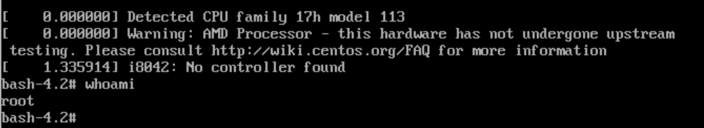

# linuxpro-homework09

## Домашнее задание
### Работа с загрузчиком

Описание/Пошаговая инструкция выполнения домашнего задания:
1. [Попасть в систему без пароля несколькими способами.](#1)
2. [Установить систему с LVM, после чего переименовать VG.](#2)
3. [Добавить модуль в initrd.](#3)

***

<a name="1"/>
</a>

### 1. Попасть в систему без пароля несколькими способами.
- 1й способ: добавим в загрузчик опцию
```
linux init=/bin/bash
```
Имеем Hyper-v: При запуске виртуальной машины, выбираем нужные пункт с загрузкой (например, по умолчанию) и нажимаем "**e**", чтобы попасть в меню редактирования параметров данного пункта загрузки.

В конце строки, начинающейся с linuxefi добавляем init=/bin/bash

и нажимае **ctrl+x** для загрузки системы
Таким образом мы попали сразу в оболочку bash с правами root

После загрузки оболочки необходимо перемонтировать корневой раздел в режим RW, если нам требуется внести какие либо изменения, например, сменить пароль **root**:
```
mount -o remount,rw /
```
- 2й способ: добавим в загрузчик опцию
```
linux rd.break
```
Так же в конце строки добавляем опцию и загружаемся через **ctrl+x**

Таким образом мы попадаем в режим **emergecy mode**. Наша корневая файловая система так же смонтирована в режиме **Read-only**. Далее в нее необходимо попасть следующим образом, и после можно будет сменить пароль от **root**:

- 3й способ: замена параметра
```
rw init=/sysroot/bin/bash
```
Так же заходим в режим редактирования пункта загрузки и заменяем параметр **ro** на **rw init=/sysroot/bin/bash**


нажимаем **ctrl+x** для загрузки в систему.
В таком варианте файловая система уже смонтирована в режиме **Read-write**

***
<a name="2"/>
</a>

### 2. Установить систему с LVM, после чего переименовать VG.

***
<a name="3"/>
</a>

### 3. Добавить модуль в initrd.
